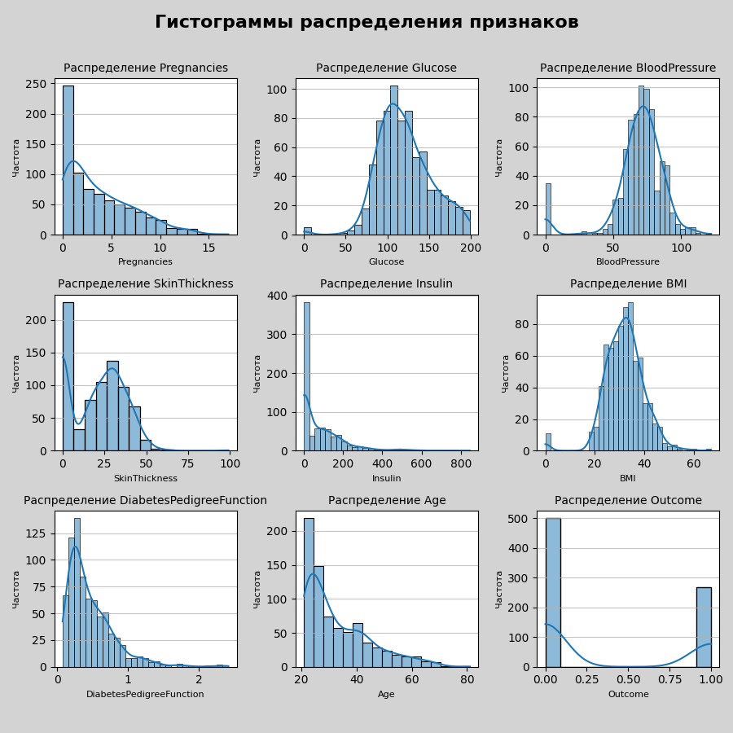
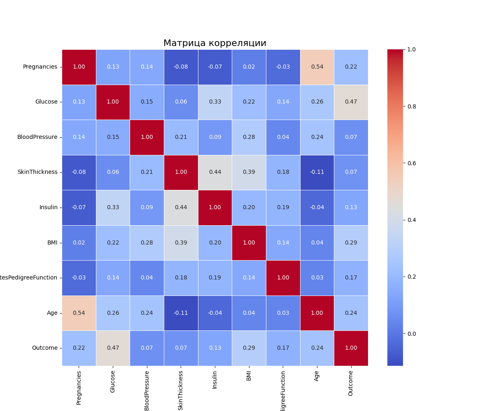
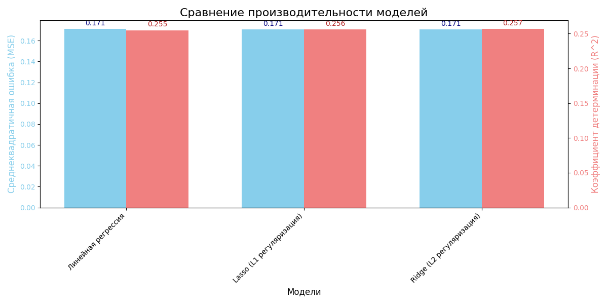

# Использование регуляризированных методов для регрессии 

## 1. Описание проекта
Данный проект был разработан в рамках дисциплины "МДК 13.01. Основы применения методов искусственного интеллекта в программировании".

**Практическое занятие №12**

- **Тема:** Использование регуляризированных методов для регрессии.

- **Основная цель**: Овладение навыками использования регуляризированных методов в задачах регрессии для повышения эффективности модели и предотвращения переобучения.

В этом проекте реализовано обучение и сравнение моделей линейной регрессии с применением L1 (Lasso) и L2 (Ridge) регуляризации на датасете Diabetes Dataset. Проект включает в себя визуализацию результатов. 

## 2. Скриншоты
### 2.1. Скриншот выполненного задания
#### 2.1.1. Основной скрипт [main.py](src/main.py)

  

## 3. Графики и диаграммы
### 3.1. Гистограммы распределения признаков: Отображают распределение каждого признака в датасете.

  

### 3.2. Матрица корреляции: Показывает корреляцию между различными признаками.

  

### 3.3. Фактические vs Предсказанные значения (Линейная регрессия): График рассеяния, показывающий фактические и предсказанные значения для базовой модели линейной регрессии.

  

### 3.4. Фактические vs Предсказанные значения (Lasso): График рассеяния, показывающий фактические и предсказанные значения для модели Lasso.

  

### 3.5. Фактические vs Предсказанные значения (Ridge): График рассеяния, показывающий фактические и предсказанные значения для модели Ridge.

  

### 3.6. Сравнение производительности моделей: Столбчатая диаграмма, сравнивающая MSE и R^2 для всех моделей.

  

## 4. Анализ результатов
1. Базовая модель линейной регрессии показала MSE = 0.1710 и R^2 = 0.2550.
2. Применение L1 регуляризации (Lasso) улучшило результаты: MSE = 0.1708 и R^2 = 0.2560 (лучшие параметры alpha = 0.001).
3. Применение L2 регуляризации (Ridge) также улучшило результаты: MSE = 0.1707 и R^2 = 0.2566 (лучшие параметры alpha = 10).
4. L2 регуляризация (Ridge) показала немного лучшие результаты, чем L1 регуляризация (Lasso), и базовую линейную регрессию, но разница незначительна.

## 5. Обсуждение возможных улучшений
- Более тщательная настройка гиперпараметров моделей, используя расширенный диапазон значений alpha и методы кросс-валидации.
- Применение более сложных методов предварительной обработки данных, таких как обработка выбросов или Feature Engineering.
- Использование других моделей машинного обучения и сравнение их производительности с регуляризированными линейными моделями (например, Random Forest, Gradient Boosting).
- Исследование влияния различных параметров регуляризации на производительность модели, в частности, визуализация изменения коэффициентов модели при изменении alpha.

## 6. Заключение
В заключение, данное практическое занятие позволило освоить навыки использования регуляризированных методов (L1 и L2) в задачах регрессии. Было показано, что применение регуляризации может улучшить производительность модели по сравнению с базовой линейной регрессией. В данном конкретном случае улучшение было незначительным, что может указывать на то, что датасет не сильно подвержен переобучению или что необходимо дальнейшее исследование параметров регуляризации. Визуализация результатов и анализ метрик позволили лучше понять влияние регуляризации на эффективность модели.

## 7. Лицензия
Этот проект распространяется под лицензией MIT - смотрите файл [LICENSE](LICENSE) для деталей.

## 8. Автор
Бедин Владислав ([MindlessMuse666](https://github.com/MindlessMuse666))

* GitHub: [MindlessMuse666](https://github.com/MindlessMuse666 "Владислав: https://github.com/MindlessMuse666")
* Telegram: [@mindless_muse](t.me/mindless_muse)
* Gmail: [mindlessmuse.666@gmail.com](mindlessmuse.666@gmail.com)
